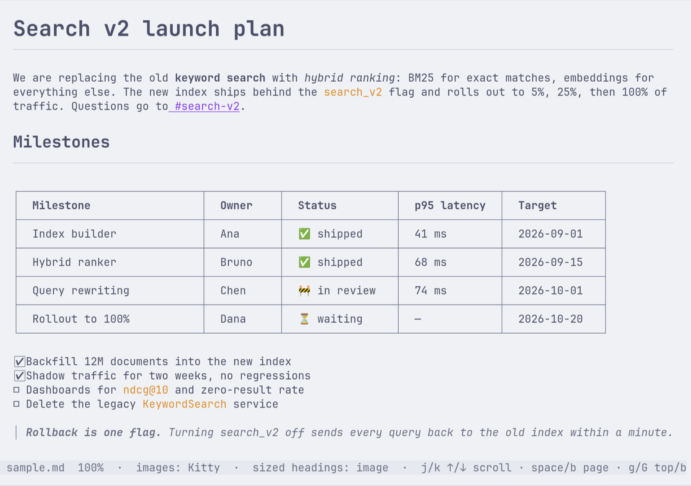
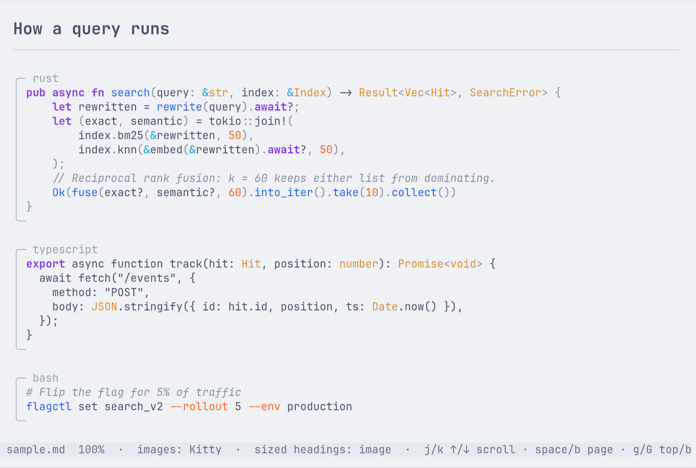
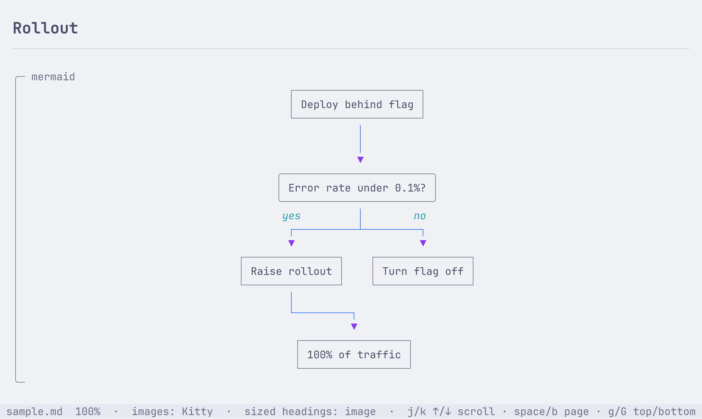
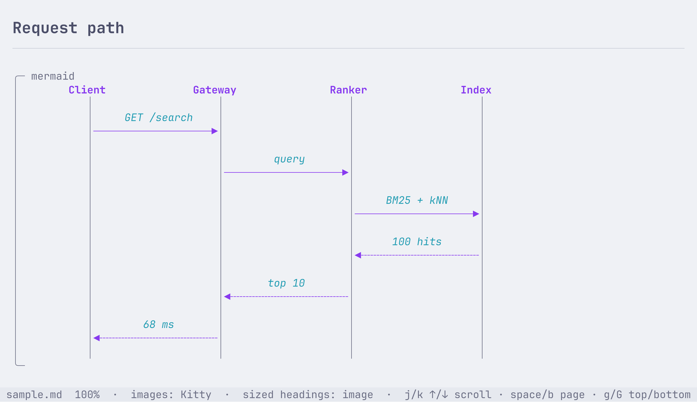
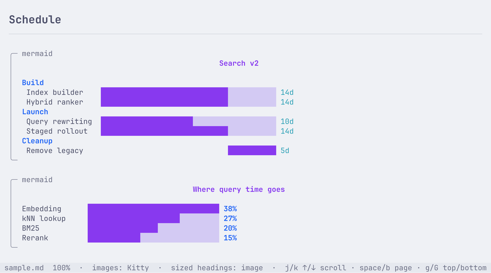
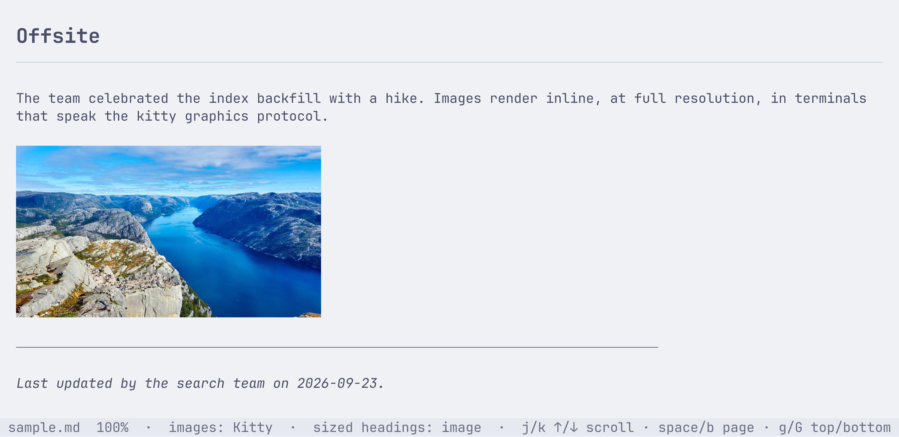

<h1 align="center">markview</h1>

<p align="center">
  <b>Read Markdown in your terminal the way it was meant to look.</b><br>
  Big headings, real images, bordered tables, highlighted code and Mermaid diagrams, in a single binary.
</p>

<p align="center">
  <a href="https://github.com/luizbafilho/markview/releases/latest"></a>
  
  
</p>

<p align="center">
  
</p>

```sh
curl --proto '=https' --tlsv1.2 -LsSf https://github.com/luizbafilho/markview/releases/latest/download/markview-installer.sh | sh
markview README.md
```

`cat` shows you pound signs and pipes. `glow` and `mdcat` get you colors. markview draws the document: titles at twice the text size, images at full resolution, tables with real borders, and diagrams from your `mermaid` code blocks. It runs inside the terminal you already use, tmux included.

## What it renders

### Headings that are actually bigger, tables with borders

In kitty 0.40+ markview sizes headings with the [text sizing protocol](https://sw.kovidgoyal.net/kitty/text-sizing-protocol/). In Ghostty and other terminals with kitty graphics, it draws each heading as an image in the same font your terminal uses, read from your Ghostty or kitty config. Tables get box borders, column alignment, and room for emoji and CJK text. Task lists get checkboxes.

### Code, highlighted by tree-sitter



Around 35 languages through tree-sitter grammars, colored with the Catppuccin palette.

### Mermaid diagrams, drawn in text

Flowcharts, sequence diagrams, Gantt charts and pie charts render straight from the fenced block. No browser, no headless Chrome, no `mmdc`.







Subgraphs, dotted arrows and some of the rarer node shapes are not supported yet.

### Images, inline



PNG, JPEG, WebP and GIF, resolved relative to the Markdown file. markview sends them with the kitty graphics protocol, falling back to Sixel, iTerm2 or colored half blocks depending on what your terminal answers. Images crop cleanly as you scroll past them.

### Light or dark, following your terminal

markview asks the terminal for its background color. Light backgrounds get [Catppuccin](https://catppuccin.com/palette) Latte, dark ones get Frappé. If you switch your terminal's theme while a document is open, markview notices within a second and repaints.

## Install

**Prebuilt binary** for macOS and Linux, x86_64 and ARM64:

```sh
curl --proto '=https' --tlsv1.2 -LsSf https://github.com/luizbafilho/markview/releases/latest/download/markview-installer.sh | sh
```

The script puts `markview` in `~/.cargo/bin`. Archives and checksums are on the [releases page](https://github.com/luizbafilho/markview/releases/latest).

**From source**, with a Rust toolchain:

```sh
cargo install --locked --git https://github.com/luizbafilho/markview
```

## Usage

```sh
markview notes.md
```

Try it on the bundled tour of everything above:

```sh
git clone https://github.com/luizbafilho/markview && cd markview
markview sample.md
```

| Key                        | Action                         |
|----------------------------|--------------------------------|
| `j` `k` / `↓` `↑` / wheel  | Scroll                         |
| `space` `d` / `PgDn`       | Page down                      |
| `b` `u` / `PgUp`           | Page up                        |
| `g` `G` / `Home` `End`     | Jump to top or bottom          |
| `t`                        | Toggle large headings          |
| `q` / `Esc`                | Quit                           |

The status bar shows which image protocol and heading mode your terminal got.

## Terminal support

markview checks what the terminal can do at startup and uses the best option it finds.

| Terminal feature                        | Headings                    | Images                  |
|-----------------------------------------|-----------------------------|-------------------------|
| Text sizing protocol (kitty 0.40+)      | Scaled text                 | Kitty graphics          |
| Kitty graphics (Ghostty, older kitty)   | Drawn in your terminal font | Kitty graphics          |
| Sixel or iTerm2 images                  | Regular bold headings       | Sixel or iTerm2         |
| Anything else                           | Regular bold headings       | Colored half blocks     |

Inside tmux, turn on passthrough so image escapes reach the outer terminal:

```tmux
set -g allow-passthrough on
```

## Built on

[ratatui](https://ratatui.rs) and [ratatui-markdown](https://crates.io/crates/ratatui-markdown) for layout and parsing, [ratatui-image](https://crates.io/crates/ratatui-image) for Sixel and iTerm2, [terminal-colorsaurus](https://crates.io/crates/terminal-colorsaurus) for theme detection.
