# mkviewer sample

A paragraph with **bold**, *italic*, ***bold italic***, ~~strikethrough~~, `inline code`, and a [link](https://example.com).
This line is long on purpose so you can see how wrapping behaves when the terminal is narrower than the text.
Unicode: café, naïve, 日本語のテキスト, 한국어, emoji 🚀✨, math ∑∫√∞.

## Images

A local PNG (512×512, transparent background):


A wide JPEG photo (1200×675):


An animated WebP with alpha (1024×1024):

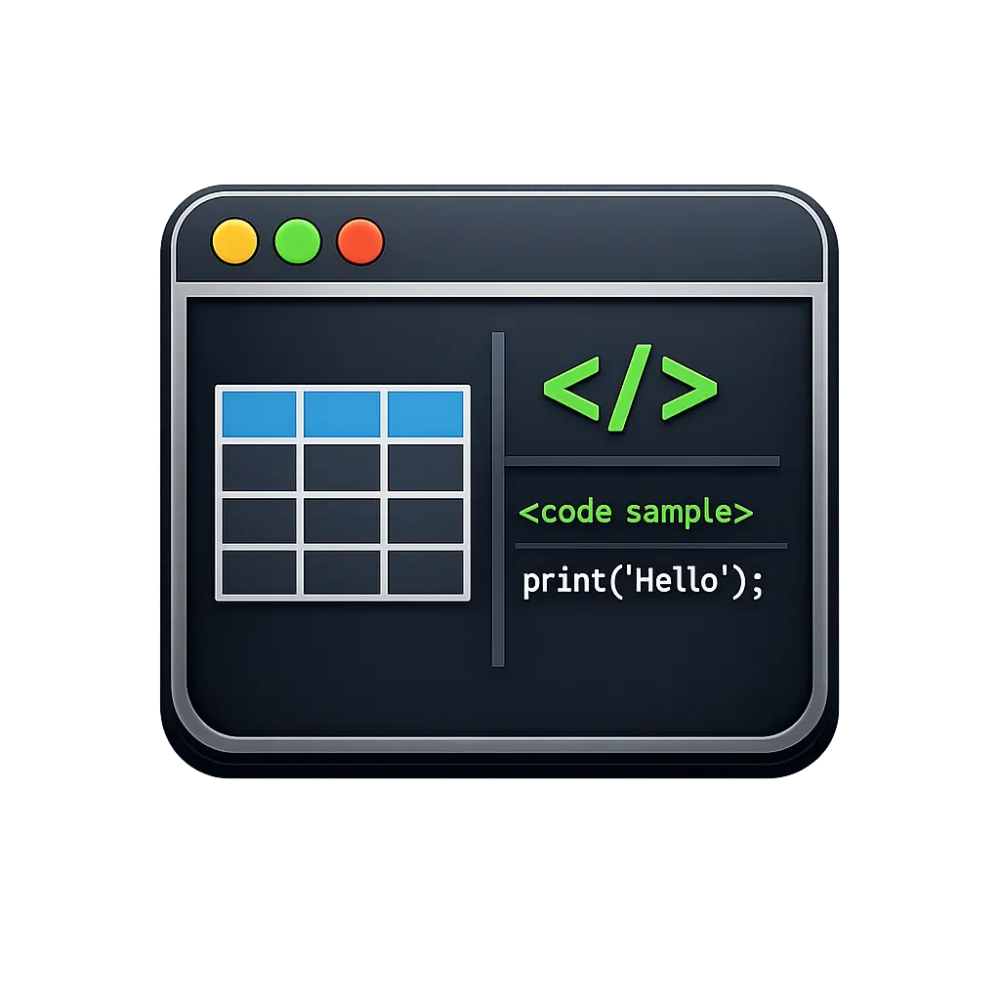

A file that does not exist:


A remote URL:


An image inline in a sentence: here is the logo  sitting mid-paragraph.

A linked image: [](https://www.rust-lang.org)

## Tables

### Tiny

| A | B |
|---|---|
| 1 | 2 |

### Single column

| Only |
|------|
| one  |
| two  |

### Alignment

| Left aligned | Centered | Right aligned |
|:-------------|:--------:|--------------:|
| apple        | 1        | 0.50          |
| banana split | 22       | 12.75         |
| cherry       | 333      | 1,024.00      |

### Inline formatting and empty cells

| Name       | Status        | Notes                                  |
|------------|---------------|----------------------------------------|
| **Parser** | ✅ done       | handles `code`, *italic*, [links](https://x.y) |
| Renderer   |               | empty cell to the left                 |
| ~~Legacy~~ | ❌ removed    | pipe escaped: a \| b                   |
| 日本語     | 🚧 wip        | CJK wide characters                    |

### Long text that must wrap

| Field | Description |
|-------|-------------|
| id | A short one. |
| description | This cell holds a long sentence that is much wider than any reasonable terminal column, so the renderer has to wrap it across several lines or truncate it, and we want to see which one it does. |
| tags | alpha, beta, gamma, delta, epsilon, zeta, eta, theta, iota, kappa, lambda, mu, nu, xi, omicron, pi, rho, sigma, tau |

### Wide (12 columns)

| ID | Name | Region | Q1 Revenue | Q2 Revenue | Q3 Revenue | Q4 Revenue | Growth | Owner | Status | Last Updated | Notes |
|----|------|--------|-----------:|-----------:|-----------:|-----------:|-------:|-------|:------:|--------------|-------|
| 001 | Acme Corp | North America | $1,200,000 | $1,350,000 | $1,410,000 | $1,600,000 | +33% | alice@example.com | Active | 2026-09-01 | Renewal due in Q1 |
| 002 | Globex | Europe | $860,000 | $790,000 | $905,000 | $1,020,000 | +18% | bob@example.com | Active | 2026-08-15 | New CFO |
| 003 | Initech | Asia Pacific | $430,000 | $410,000 | $395,000 | $380,000 | -12% | carol@example.com | At risk | 2026-07-30 | Churn signals |
| 004 | Umbrella | South America | $2,100,000 | $2,250,000 | $2,300,000 | $2,480,000 | +18% | dave@example.com | Active | 2026-09-10 | Expansion deal |

### Tall (many rows)

| # | Language | Paradigm | Typing | First appeared |
|--:|----------|----------|--------|---------------:|
| 1 | C | Imperative | Static, weak | 1972 |
| 2 | C++ | Multi-paradigm | Static, nominal | 1985 |
| 3 | Erlang | Functional, concurrent | Dynamic, strong | 1986 |
| 4 | Haskell | Purely functional | Static, inferred | 1990 |
| 5 | Python | Multi-paradigm | Dynamic, duck | 1991 |
| 6 | Lua | Scripting | Dynamic | 1993 |
| 7 | Java | Object-oriented | Static, nominal | 1995 |
| 8 | JavaScript | Multi-paradigm | Dynamic, weak | 1995 |
| 9 | Ruby | Object-oriented | Dynamic, duck | 1995 |
| 10 | OCaml | Functional | Static, inferred | 1996 |
| 11 | C# | Multi-paradigm | Static, nominal | 2000 |
| 12 | Go | Concurrent | Static, structural | 2009 |
| 13 | Rust | Multi-paradigm | Static, affine | 2010 |
| 14 | Kotlin | Multi-paradigm | Static, inferred | 2011 |
| 15 | Elixir | Functional | Dynamic, strong | 2012 |
| 16 | TypeScript | Multi-paradigm | Static, structural | 2012 |
| 17 | Swift | Multi-paradigm | Static, inferred | 2014 |
| 18 | Zig | Imperative | Static, manual | 2016 |

## Mermaid

### Flowchart, top-down (only syntax the library supports)

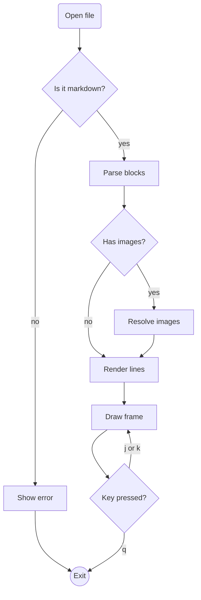

### Flowchart, left-to-right (only syntax the library supports)

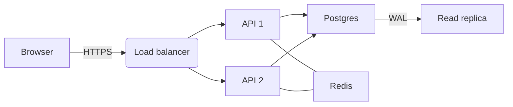

The next two use standard Mermaid syntax the library does not parse
(stadium, database and parallelogram shapes, dotted and thick arrows,
subgraphs). Watch what happens to them.

### Flowchart with subgraphs and extra shapes (unsupported)

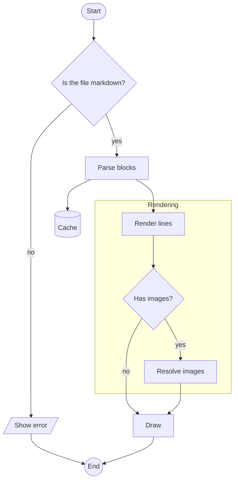

### Graph with dotted and thick arrows (unsupported)

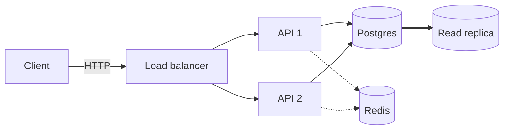

### Sequence diagram

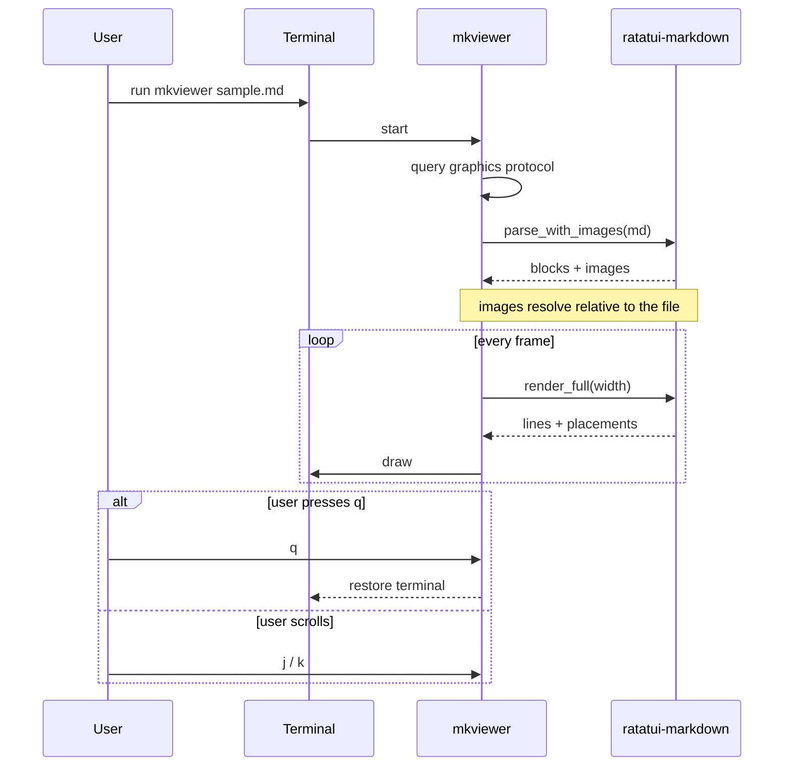

### State diagram

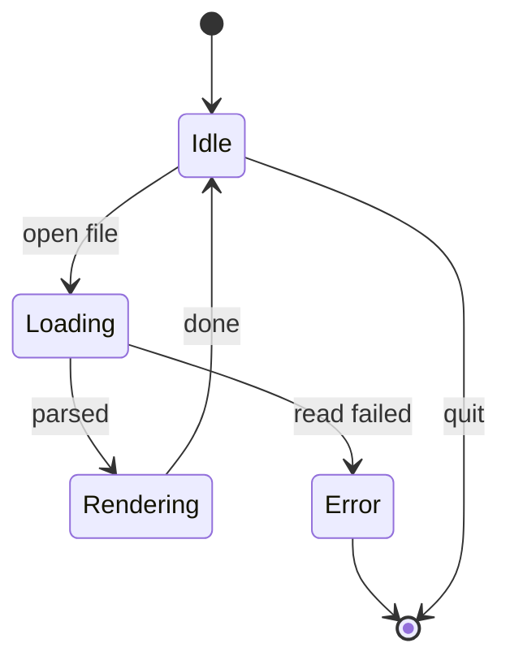

### Class diagram

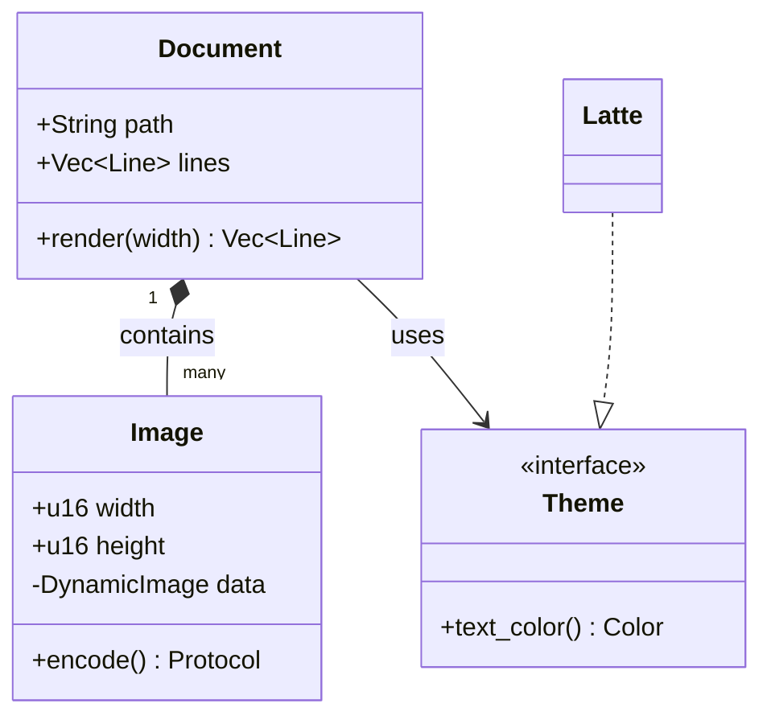

### Gantt chart

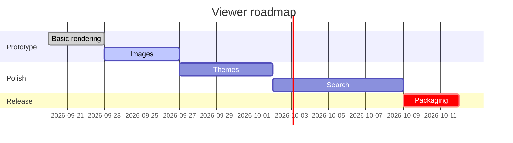

### Pie chart

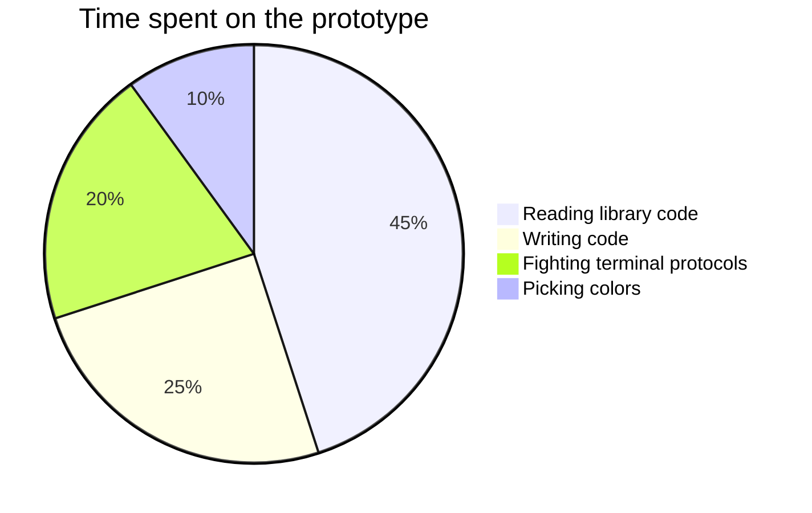

### Quadrant chart

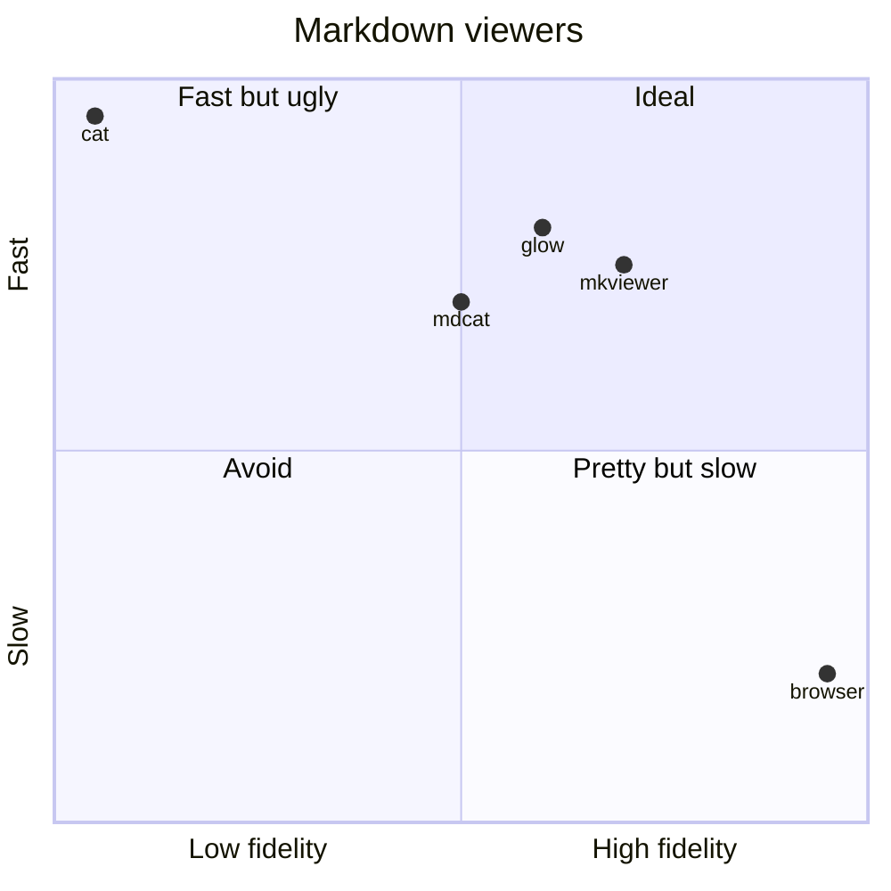

### Block diagram

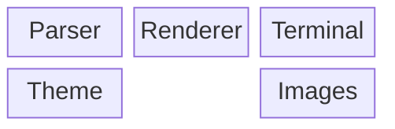

## Lists

- First item
- Second item with `code`
  - Nested item
    - Deeply nested item
  - Another nested item
- Third item with a long line that should wrap onto the next line when the terminal is narrow enough for it to matter

1. Ordered one
2. Ordered two
   1. Nested ordered
   2. Nested ordered again
3. Ordered three

- [ ] Unchecked task
- [x] Checked task

## Code

```rust
use std::collections::HashMap;

/// Count words in a string.
fn count(text: &str) -> HashMap<&str, usize> {
    let mut map = HashMap::new();
    for word in text.split_whitespace() {
        *map.entry(word).or_insert(0) += 1;
    }
    map
}
```

```typescript
type Result<T> = { ok: true; value: T } | { ok: false; error: string };

export async function load(path: string): Promise<Result<string>> {
  const res = await fetch(`/files/${encodeURIComponent(path)}`);
  return res.ok ? { ok: true, value: await res.text() } : { ok: false, error: res.statusText };
}
```

```json
{ "name": "mkviewer", "version": "0.1.0", "features": ["images", "mermaid"], "stable": false }
```

```
plain block, no language, with a line that is far too long to fit in the terminal and has to either wrap or be cut off somewhere
```

## Quotes

> A blockquote with *emphasis*.
> It spans a couple of lines.
>
> > A nested quote inside it.

---

# Heading 1
## Heading 2
### Heading 3
#### Heading 4
##### Heading 5
###### Heading 6
