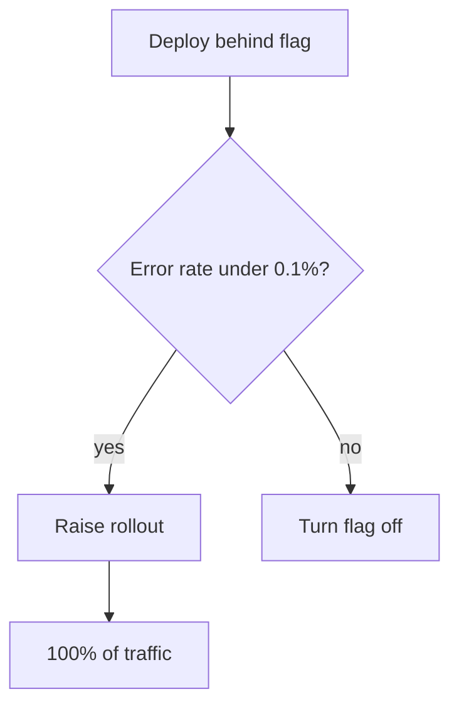
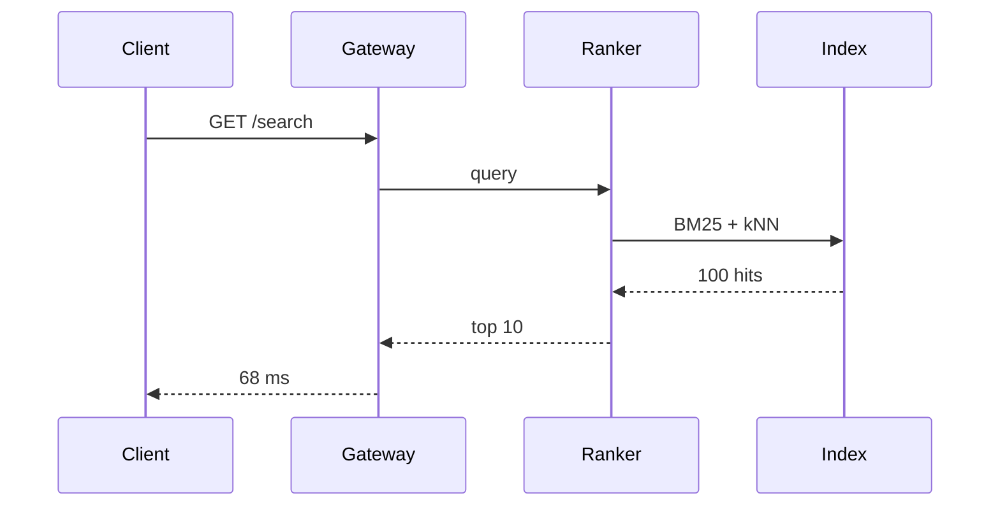
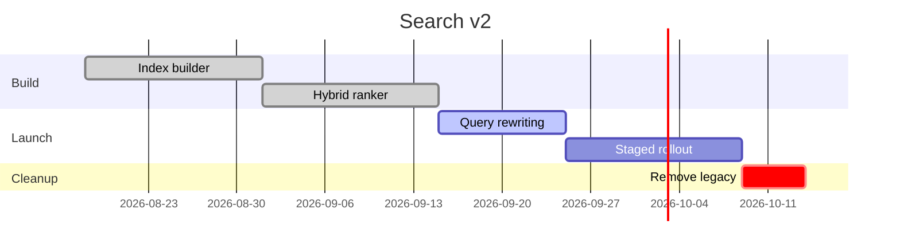
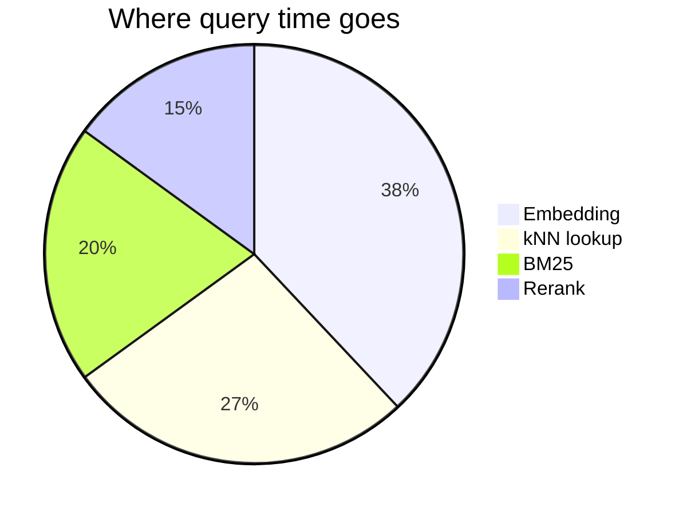

# Search v2 launch plan

We are replacing the old **keyword search** with *hybrid ranking*: BM25 for exact matches, embeddings for everything else. The new index ships behind the `search_v2` flag and rolls out to 5%, 25%, then 100% of traffic. Questions go to [#search-v2](https://example.com).

## Milestones

| Milestone         | Owner  | Status         |  p95 latency | Target     |
|:------------------|:-------|:--------------:|-------------:|:-----------|
| Index builder     | Ana    | ✅ shipped     |       41 ms  | 2026-09-01 |
| Hybrid ranker     | Bruno  | ✅ shipped     |       68 ms  | 2026-09-15 |
| Query rewriting   | Chen   | 🚧 in review   |       74 ms  | 2026-10-01 |
| Rollout to 100%   | Dana   | ⏳ waiting     |          —   | 2026-10-20 |

- [x] Backfill 12M documents into the new index
- [x] Shadow traffic for two weeks, no regressions
- [ ] Dashboards for `ndcg@10` and zero-result rate
- [ ] Delete the legacy `KeywordSearch` service

> **Rollback is one flag.** Turning `search_v2` off sends every query back to the old index within a minute.

## How a query runs

```rust
pub async fn search(query: &str, index: &Index) -> Result<Vec<Hit>, SearchError> {
    let rewritten = rewrite(query).await?;
    let (exact, semantic) = tokio::join!(
        index.bm25(&rewritten, 50),
        index.knn(&embed(&rewritten).await?, 50),
    );
    // Reciprocal rank fusion: k = 60 keeps either list from dominating.
    Ok(fuse(exact?, semantic?, 60).into_iter().take(10).collect())
}
```

```typescript
export async function track(hit: Hit, position: number): Promise<void> {
  await fetch("/events", {
    method: "POST",
    body: JSON.stringify({ id: hit.id, position, ts: Date.now() }),
  });
}
```

```bash
# Flip the flag for 5% of traffic
flagctl set search_v2 --rollout 5 --env production
```

## Rollout





## Schedule





## Offsite

The team celebrated the index backfill with a hike. Images render inline, at full resolution, in terminals that speak the kitty graphics protocol.


---

*Last updated by the search team on 2026-09-23.*
